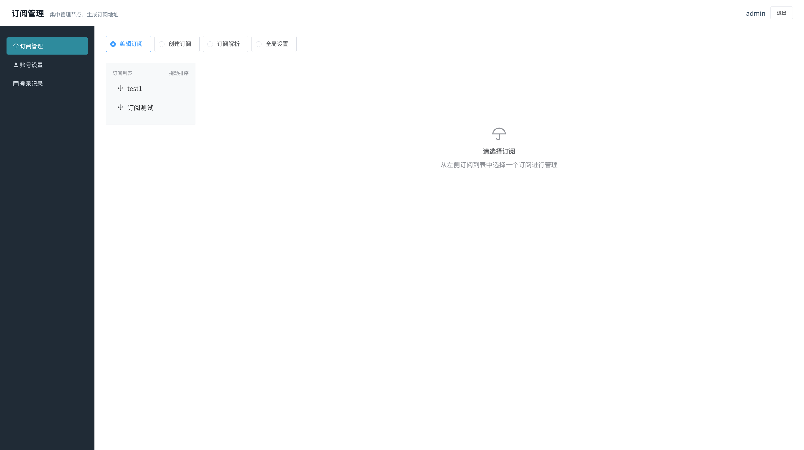
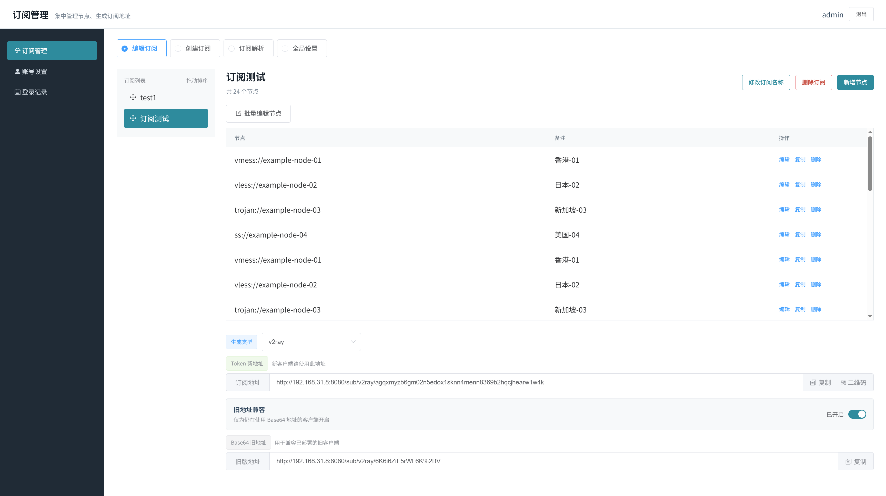

# Sublink v3

Sublink 是一个面向个人使用的自托管订阅管理工具，用于集中保存代理节点，并生成 V2Ray、Clash 和 Surge 订阅地址。

> 本项目基于 [jaaksii/sublink](https://github.com/jaaksii/sublink) Fork 并继续维护。
> v3 是本仓库自行维护的版本，并非原项目官方版本。感谢原作者和历史贡献者提供的基础实现。

## 界面预览

| **订阅管理** | **节点与订阅地址** |
| :----: | :----: |
|   |   |


## v3 主要变化

- 重构订阅管理界面和节点列表
- 支持拖动调整订阅顺序
- 使用随机 Token 生成订阅地址，避免在地址中直接暴露订阅名称
- 支持按订阅开启旧版 Base64 地址兼容
- 支持远程订阅展开，以及节点地址和名称重写
- 增加数据库迁移和启动时自动升级
- 统一客户端默认订阅名称为 `v3订阅`
- 修复 Windows 下 Clash、Surge 配置文件的编码问题
- 优化前后端本地开发、静态资源构建和 Docker 启动流程

## 功能

- 集中管理多个订阅及其节点
- 创建、编辑、复制和删除节点
- 批量编辑订阅节点
- 调整订阅显示顺序
- 生成 V2Ray、Clash、Surge 订阅
- 将 HTTP/HTTPS 远程订阅展开到生成结果中
- 通过 Token 地址访问订阅
- 为仍在使用旧地址的客户端单独开启兼容模式
- 管理 Clash、Surge 基础配置
- 修改管理账号并查看登录记录

支持管理的节点类型包括：

`vless`、`vmess`、`ss`、`ssr`、`trojan`、`hysteria`、`hy2`，以及 HTTP/HTTPS 远程订阅地址。

## 订阅地址

v3 默认生成随机 Token 地址：

```text
http://服务器地址/sub/v2ray/<token>
http://服务器地址/sub/clash/<token>
http://服务器地址/sub/surge/<token>
```

- Token 地址不会因为修改订阅名称而变化
- 客户端默认显示名称为 `v3订阅`
- 从旧版本升级的订阅默认保留旧地址兼容
- v3 新建的订阅默认关闭旧地址兼容
- 旧地址依赖订阅名称，修改名称后需要重新复制旧地址

Token 相当于订阅访问凭据，请勿公开分享。

## Docker 部署

v3 默认从当前 Git 仓库获取代码并在服务器本地构建镜像，不要使用上游旧版 Docker 镜像。

默认部署约定：

| 项目 | 值 |
| --- | --- |
| 镜像 | `sublink:v3` |
| 容器 | `sublink-v3` |
| 对外端口 | `8000` |
| 数据目录 | `/root/sublink-v3/db` |
| 仓库目录 | `/root/sublink-v3/release` |

### 1. 准备目录并拉取代码

```bash
mkdir -p /root/sublink-v3/db
mkdir -p /root/sublink-v3/backup
git clone https://github.com/kjqg-cn/sublink.git \
  /root/sublink-v3/release
```

如果已经 Clone 过仓库，不需要重新 Clone 或上传压缩包，更新代码即可：

```bash
cd /root/sublink-v3/release
git pull --ff-only
```

### 2. 构建镜像

```bash
cd /root/sublink-v3/release
docker build -t sublink:v3 .
```

### 3. 启动容器

```bash
docker run -d --restart always \
  --name sublink-v3 \
  -p 8000:5000 \
  -v /root/sublink-v3/db:/app/app/db \
  -e PORT=5000 \
  sublink:v3
```

容器启动时会自动执行 `upgrade_db.py`：

- 新数据库会自动初始化
- 已有数据库会自动补齐 v3 新增字段和索引
- 不需要手动执行 `flask db upgrade`

### 4. 检查部署结果

```bash
docker ps --filter name=sublink-v3
docker logs --tail 100 sublink-v3
curl -I http://127.0.0.1:8000
```

浏览器访问：

```text
http://服务器IP:8000
```

### 5. 配置 Nginx

通过 Nginx 对外提供服务时，将反向代理指向：

```nginx
proxy_pass http://127.0.0.1:8000;
```

检查并重载配置：

```bash
nginx -t
systemctl reload nginx
```

已经指向 `8000` 时不需要重复修改。

## 更新现有部署

### 1. 备份当前镜像

先记录并备份当前容器使用的镜像，便于回退：

```bash
OLD_IMAGE=$(docker inspect -f '{{.Image}}' sublink-v3 2>/dev/null || true)
if [ -n "$OLD_IMAGE" ]; then
  docker tag "$OLD_IMAGE" sublink:v3-backup
fi
```

### 2. 停止容器并备份数据库

先停止容器，避免复制 SQLite 数据库时仍有写入：

```bash
docker stop sublink-v3
if [ -f /root/sublink-v3/db/sub.db ]; then
  cp -a /root/sublink-v3/db \
    /root/sublink-v3/backup/db.$(date +%Y%m%d-%H%M%S)
fi
```

此时先不要删除旧容器。如果拉取代码或构建镜像失败，可以执行 `docker start sublink-v3` 恢复旧服务。

### 3. 拉取代码并构建镜像

服务器上的仓库没有未提交改动时，执行：

```bash
cd /root/sublink-v3/release
git pull --ff-only
docker build -t sublink:v3 .
```

`--ff-only` 可以避免服务器在更新时意外产生合并提交。如果提示存在本地修改，应先确认这些修改是否需要保留。

### 4. 替换容器

```bash
docker rm sublink-v3
docker run -d --restart always \
  --name sublink-v3 \
  -p 8000:5000 \
  -v /root/sublink-v3/db:/app/app/db \
  -e PORT=5000 \
  sublink:v3
```

然后重新执行部署检查命令，确认日志和 `8000` 端口正常。

## 部署失败回退

删除失败的新容器并恢复备份镜像：

```bash
docker rm -f sublink-v3 2>/dev/null || true
docker tag sublink:v3-backup sublink:v3
docker run -d --restart always \
  --name sublink-v3 \
  -p 8000:5000 \
  -v /root/sublink-v3/db:/app/app/db \
  -e PORT=5000 \
  sublink:v3
```

如果还需要恢复数据库，请先停止容器，再从 `/root/sublink-v3/backup/` 中选择对应时间的备份恢复。数据库升级和恢复期间不要同时运行多个后端实例。

## 默认账号

首次启动时会创建默认管理账号：

```text
账号：admin
密码：admin
```

首次登录后请立即修改账号和密码。

重置账号密码：

```bash
docker exec -it sublink-v3 python init_user_pw.py
```

本地运行时：

```bash
python init_user_pw.py
```

## 清空登录记录

Docker：

```bash
docker exec -it sublink-v3 python init_login_log.py
```

本地运行：

```bash
python init_login_log.py
```

## 安全建议

- 本项目定位为个人自托管工具，不适合作为多租户公共服务
- 部署到公网时，建议通过 Nginx、Caddy 等反向代理启用 HTTPS
- 修改默认账号和密码，不要将管理后台直接暴露给不可信网络
- Token 地址可以直接读取订阅内容，应像密码一样妥善保存
- 添加远程订阅后，服务器会主动请求对应的 HTTP/HTTPS 地址
- 升级或迁移前请备份宿主机的 `/root/sublink-v3/db` 目录

## License

本项目基于 [MIT License](LICENSE.md) 发布。Fork 来源和原始版权信息见许可证及原项目仓库。
